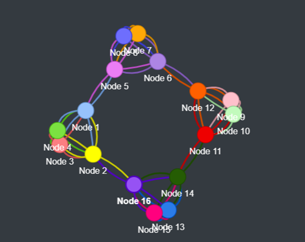
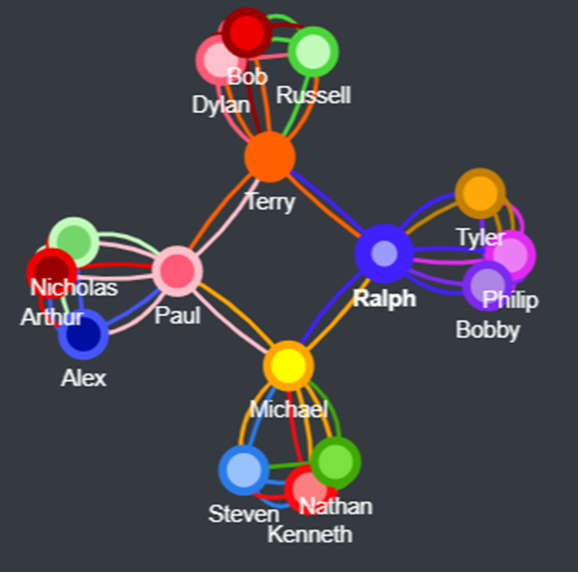
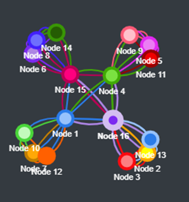
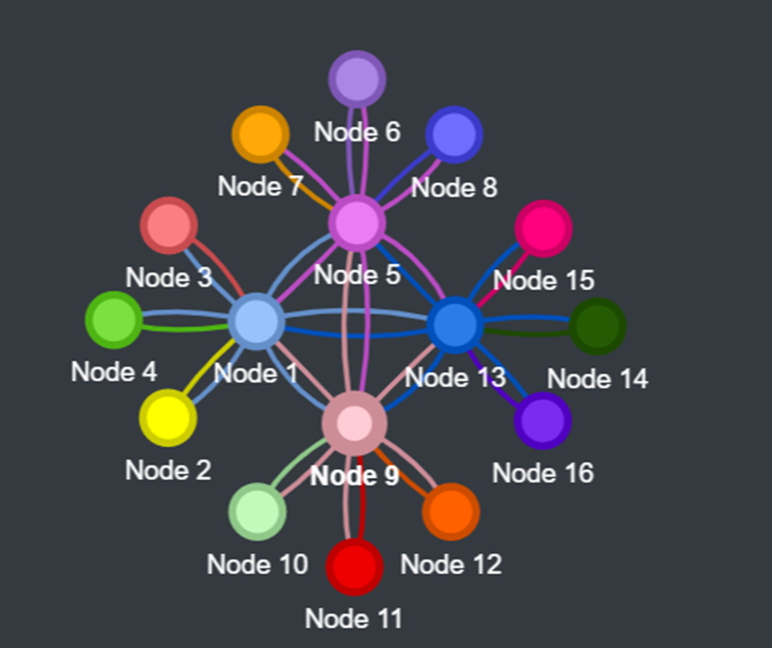

# Blockchain Simulator Experiment

# Overview

This experiment utilizes the Blockchain Simulator to analyze the performance of different network topologies in a blockchain environment. The experiment involves running the simulator for 5 minutes and observing the results across four different network topologies.

# Experiment Setup

Topologies:

1. Topology 1: Nodes in clusters are fully connected. Two nodes from each cluster are connected to at least two nodes from other clusters.
   

2. Topology 2: Nodes in clusters are fully connected. Only one node from each cluster connects to other clusters.
   

3. Topology 3: Nodes in clusters are fully connected. All leaders are fully connected among themselves.
   

4. Topology 4: All nodes in a cluster connect to their leader, and all leaders are fully connected.
   

# Procedure:

The simulator is run for 5 minutes for each topology.

Observations include stale blocks, estimated time for a block to reach all nodes, and estimated time for a block to reach 50% of the nodes.

# Observations and Results

1. Topology 1
   a. Average stale blocks: 6.8
   b. Average time for a block to reach all nodes: 204.97 seconds
   c. Average time for a block to reach 50% of nodes: 105.08 seconds

2. Topology 2
   a. Average stale blocks: 8.2
   b. Average time for a block to reach all nodes: 158.21 seconds
   c. Average time for a block to reach 50% of nodes: 87.82 seconds

3. Topology 3
   a. Average stale blocks: 3.8
   b. Average time for a block to reach all nodes: 107.69 seconds
   c. Average time for a block to reach 50% of nodes: 75.04 seconds

4. Topology 4
   a. Average stale blocks: 8.0
   b. Average time for a block to reach all nodes: 107.54 seconds
   c. Average time for a block to reach 50% of nodes: 79.71 seconds

# Conclusion

Topology 1 had the highest time for block propagation but a moderate stale block rate.

Topology 2 improved propagation speed compared to Topology 1 but had the highest stale block rate.

Topology 3 had the lowest stale block rate and fastest propagation.

Topology 4 had similar propagation to Topology 3 but a higher stale block rate.

Topology selection impacts blockchain performance significantly, affecting propagation speed and stale block generation. The best topology depends on the balance between propagation efficiency and stale block minimization.

# Reference

The following github link is the simulator that is used in this experiment
https://github.com/simewu/blockchain-simulator

